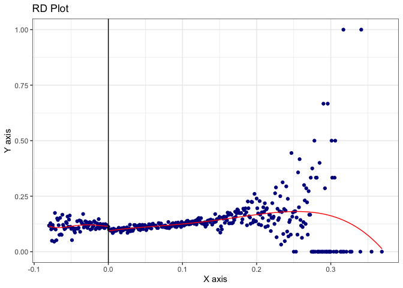

# Hansen DWI Replication

**Directions:** Download `hansen_dwi.dta` from GitHub at the following
address. Note these data are not exactly the same as his because of
confidentiality issues (so he couldn’t share all of it).

<https://github.com/scunning1975/causal-inference-class/raw/master/hansen_dwi>

The outcome variable is `recidivism` which is measuring whether the
person showed back up in the data within 4 months. Use this data to
answer the following questions.

``` r
## hansen.R --------------------------------------------------------------------
## Kyle Butts, CU Boulder Economics
## 
## replicate figures and tables in Hansen 2015 AER

library(fixest)
library(ggplot2)
library(rdrobust)
library(rddensity)
library(binsreg)

# load the data from github
df <- haven::read_dta("https://github.com/scunning1975/causal-inference-class/raw/master/hansen_dwi.dta")
```

1.  We will only focus on the 0.08 BAC cutoff; not the 0.15 cutoff. Take
    the following steps.

<!-- -->

1.  Create a treatment variable (`dui`) equaling 1 if `bac1 >= 0.08` and
    0 otherwise in your do/R file.

``` r
# 1.a. create dui treatment variable for bac1>=0.08
df$dui = (df$bac1 > 0.08)
```

2.  Store `bac1` into `bac1_orig` and then center the `bac1` variable,
    i.e. subtract $0.08$ so that the cutoff is now zero.

``` r
# 1.b. Re-center our running variable at bac1=0.08
df$bac1_orig = df$bac1
df$bac1 = df$bac1 - 0.08
```

3.  Replicate Hansen’s Figure 1 examining whether there is any evidence
    for manipulation on the running variable. Produce a raw histogram
    using `bac1`, then use the density test in Cattaneo, Titunik and
    Farrell’s `rddensity` package. Can you find any evidence for
    manipulation? What about heaping?

``` r
# 1.c. Find evidence for manipulation or heaping using histograms
ggplot(df) + 
  geom_histogram(
    aes(x = bac1), binwidth = 0.001,
    alpha = 0.8, color = "steelblue"
  ) + 
  labs(
    x = "Blood Alcohol Content",
    y = "Frequency",
    title = "Replicating Figure 1 of Hansen AER 2015"
  ) + 
  theme_bw()
```

<!-- -->

``` r
# Use rddensity from Cattnaeo, Titunik and Farrell papers
rddensity::rddensity(X = df$bac1, c = 0.08) |> summary()
```


    Manipulation testing using local polynomial density estimation.

    Number of obs =       214558
    Model =               unrestricted
    Kernel =              triangular
    BW method =           estimated
    VCE method =          jackknife

    c = 0.08              Left of c           Right of c          
    Number of obs         141131              73427               
    Eff. Number of obs    35657               28843               
    Order est. (p)        2                   2                   
    Order bias (q)        3                   3                   
    BW est. (h)           0.023               0.023               

    Method                T                   P > |T|             
    Robust                -2.2511             0.0244              

    Warning in summary.CJMrddensity(rddensity::rddensity(X = df$bac1, c = 0.08)):
    There are repeated observations. Point estimates and standard errors have been
    adjusted. Use option massPoints=FALSE to suppress this feature.


    P-values of binomial tests (H0: p=0.5).

    Window Length / 2          <c     >=c    P>|T|
    0.000                    1463       0    0.0000
    0.000                    1463       0    0.0000
    0.000                    1463       0    0.0000
    0.000                    1463       0    0.0000
    0.000                    1463       0    0.0000
    0.000                    1463       0    0.0000
    0.000                    1463       0    0.0000
    0.000                    1463       0    0.0000
    0.000                    1463       0    0.0000
    0.000                    1463       0    0.0000

2.  We are going to test for manipulation around the cutoff (following
    Table 2 Panel A). Run RD regressions using a local-linear estimator
    on `white`, `male`, age (`aged`) and accident (`acc`) as dependent
    variables. Are the covariates balanced at the cutoff? Use data in
    `bac1_orig` 0.03 to 0.13 (or `bac1` in -0.05 to 0.05). Check if the
    results are robust to a more narrow bandwidth of `bac1_orig` in
    0.055 to 0.105.

``` r
# 2. Are the covariates balanced at the cutoff? 
# Use two separate bandwidths (0.03 to 0.13; 0.055 to 0.105)
# yi = Xi′γ + α1 DUIi + α2 BACi + α3 BACi × DUIi + ui
feols(
  c(white, male, acc, aged) ~ dui + bac1 + i(dui, bac1), 
  df[df$bac1_orig >= 0.03 & df$bac1_orig <= 0.13, ], vcov = "hc1"
) |> 
  etable()
```

    The variable 'dui::TRUE:bac1' has been removed because of collinearity (see $collin.var).
    The variable 'dui::TRUE:bac1' has been removed because of collinearity (see $collin.var).
    The variable 'dui::TRUE:bac1' has been removed because of collinearity (see $collin.var).
    The variable 'dui::TRUE:bac1' has been removed because of collinearity (see $collin.var).

                                  model 1            model 2            model 3
    Dependent Var.:                 white               male                acc
                                                                               
    (Intercept)        0.8463*** (0.0041) 0.7842*** (0.0046) 0.0834*** (0.0033)
    duiTRUE               0.0057 (0.0050)    0.0062 (0.0057)   -0.0034 (0.0041)
    bac1                  0.0944 (0.0941)    0.0971 (0.1086) 0.7925*** (0.0807)
    bac1 x dui = FALSE   -0.0156 (0.2340)   -0.3071 (0.2632) -1.888*** (0.2031)
    __________________ __________________ __________________ __________________
    S.E. type          Heteroskedas.-rob. Heteroskedas.-rob. Heteroskedas.-rob.
    Observations                   89,967             89,967             89,967
    R2                            0.00013            5.07e-5            0.00151
    Adj. R2                       9.66e-5            1.73e-5            0.00147

                                 model 4
    Dependent Var.:                 aged
                                        
    (Intercept)        33.92*** (0.1346)
    duiTRUE             -0.1405 (0.1644)
    bac1                  6.886* (3.065)
    bac1 x dui = FALSE -76.05*** (7.844)
    __________________ _________________
    S.E. type          Heteroskeda.-rob.
    Observations                  89,967
    R2                           0.00235
    Adj. R2                      0.00231
    ---
    Signif. codes: 0 '***' 0.001 '**' 0.01 '*' 0.05 '.' 0.1 ' ' 1

``` r
feols(
  c(white, male, acc, aged) ~ dui + bac1 + i(dui, bac1), 
  df[df$bac1_orig >= 0.055 & df$bac1_orig <= 0.105, ], vcov = "hc1"
) |> 
  etable()
```

    The variable 'dui::TRUE:bac1' has been removed because of collinearity (see $collin.var).
    The variable 'dui::TRUE:bac1' has been removed because of collinearity (see $collin.var).
    The variable 'dui::TRUE:bac1' has been removed because of collinearity (see $collin.var).
    The variable 'dui::TRUE:bac1' has been removed because of collinearity (see $collin.var).

                                  model 1            model 2            model 3
    Dependent Var.:                 white               male                acc
                                                                               
    (Intercept)        0.8479*** (0.0050) 0.7859*** (0.0057) 0.0845*** (0.0040)
    duiTRUE               0.0057 (0.0066)   -0.0021 (0.0076)    0.0007 (0.0053)
    bac1                 -0.0439 (0.2756)   0.5984. (0.3193)   0.3862. (0.2256)
    bac1 x dui = FALSE    0.3751 (0.5126)   -0.6120 (0.5815)  -1.286** (0.4219)
    __________________ __________________ __________________ __________________
    S.E. type          Heteroskedas.-rob. Heteroskedas.-rob. Heteroskedas.-rob.
    Observations                   46,957             46,957             46,957
    R2                            0.00013            0.00012            0.00022
    Adj. R2                        6.4e-5            5.94e-5            0.00016

                                 model 4
    Dependent Var.:                 aged
                                        
    (Intercept)        34.02*** (0.1650)
    duiTRUE             -0.1301 (0.2171)
    bac1                  0.9633 (9.030)
    bac1 x dui = FALSE -58.62*** (16.97)
    __________________ _________________
    S.E. type          Heteroskeda.-rob.
    Observations                  46,957
    R2                           0.00107
    Adj. R2                      0.00100
    ---
    Signif. codes: 0 '***' 0.001 '**' 0.01 '*' 0.05 '.' 0.1 ' ' 1

3.  Now, we turn our main result, estimating the effect of getting a DUI
    on recidivism (`recid`).

<!-- -->

1.  Run an RD estimate using the `rdrobust` command (from the `rdrobust`
    package in R)

``` r
# 3. Estimate RD of DUI on Recidivism
rdrobust(
  y = df$recidivism, x = df$bac1, c = 0
)
```

    [1] "Mass points detected in the running variable."

    Call: rdrobust

    Number of Obs.               214558
    BW type                       mserd
    Kernel                   Triangular
    VCE method                       NN

    Number of Obs.                23010       191548
    Eff. Number of Obs.           16574        41013
    Order est. (p)                    1            1
    Order bias  (q)                   2            2
    BW est. (h)                   0.031        0.031
    BW bias (b)                   0.050        0.050
    rho (h/b)                     0.633        0.633
    Unique Obs.                      81          318

2.  Like all RD applications, you need to include a plot of the
    underlying data. Plot the RD estimator using the `rdplot` command
    (from the `rdrobust` package in R).

``` r
rdplot(
  y = df$recidivism, x = df$bac1, c = 0
)
```

    [1] "Mass points detected in the running variable."

<!-- -->

4.  Repeat but drop units in the close vicinity of 0.08 (0.079-0.081)
    (i.e., the “donut hole” regression). Do the results stay the same?

``` r
df_donut <- df[df$bac1_orig <= 0.79 | df$bac1_orig >= 0.081, ]
rdrobust(
  y = df_donut$recidivism, x = df_donut$bac1, c = 0
)
```

    [1] "Mass points detected in the running variable."

    Call: rdrobust

    Number of Obs.               214558
    BW type                       mserd
    Kernel                   Triangular
    VCE method                       NN

    Number of Obs.                23010       191548
    Eff. Number of Obs.           16574        41013
    Order est. (p)                    1            1
    Order bias  (q)                   2            2
    BW est. (h)                   0.031        0.031
    BW bias (b)                   0.050        0.050
    rho (h/b)                     0.633        0.633
    Unique Obs.                      81          318
