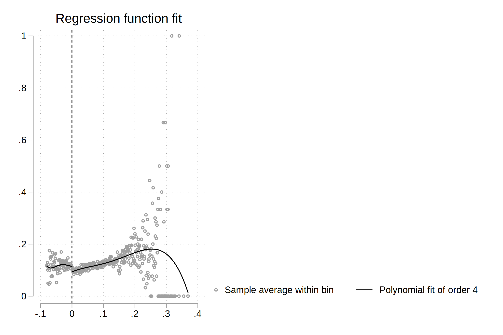

# Hansen DWI Replication

**Directions:** Download `hansen_dwi.dta` from GitHub at the following
address. Note these data are not exactly the same as his because of
confidentiality issues (so he couldn’t share all of it).

<https://github.com/scunning1975/causal-inference-class/raw/master/hansen_dwi>

``` stata
********************************************************************************
* name: hansen.do
* author: scott cunningham (baylor)
* description: replicate figures and tables in Hansen 2015 AER
* last updated: december 5, 2021
********************************************************************************

* Install packages:
* ssc install estout
* net install rdrobust, from(https://raw.githubusercontent.com/rdpackages/rdrobust/master/stata) replace
* ssc install rdrobust, replace
* net install rddensity, from(https://raw.githubusercontent.com/rdpackages/rddensity/master/stata) replace
* net install lpdensity, from(https://sites.google.com/site/nppackages/lpdensity/stata) replace

* load the data from github
use "https://github.com/scunning1975/causal-inference-class/raw/master/hansen_dwi.dta", clear
```

The outcome variable is `recidivism` which is measuring whether the
person showed back up in the data within 4 months. Use this data to
answer the following questions.

1.  We will only focus on the 0.08 BAC cutoff; not the 0.15 cutoff. Take
    the following steps.

<!-- -->

1.  Create a treatment variable (`dui`) equaling 1 if `bac1 >= 0.08` and
    0 otherwise in your do/R file.

``` stata
*-> 1.a. create dui treatment variable for bac1>=0.08
gen dui = 0
replace dui = 1 if bac1 >= 0.08 & bac1 ~= . 
// Stata when it sees a period (missing) in a variable it thinks that the
// observation is equal to positive infinity. And so since positive infinity
// is greater than 0.08, it will assign dui = 1 for that missing value which 
// can create major problems. 
```

    (191,548 real changes made)

2.  Store `bac1` into `bac1_orig` and then center the `bac1` variable,
    i.e. subtract $0.08$ so that the cutoff is now zero.

``` stata
*-> 1.b. Re-center our running variable at bac1=0.08
rename bac1 bac1_orig
gen bac1 = bac1_orig - 0.08
```

3.  Replicate Hansen’s Figure 1 examining whether there is any evidence
    for manipulation on the running variable. Produce a raw histogram
    using `bac1`, then use the density test in Cattaneo, Titunik and
    Farrell’s `rddensity` package. Can you find any evidence for
    manipulation? What about heaping?

``` stata
*-> 1.c. Find evidence for manipulation or heaping using histograms
histogram bac1, discrete width(0.001) ytitle(Density) xtitle(Running variable (blood alcohol content)) xline(0.0) title(Density of observations across the running variable)
```

    (start=-.08, width=.001)
    (note:  named style red * 1.2 not found in class color, default attributes used)
    (note:  named style red * 1.2 not found in class color, default attributes used)
    (note:  named style red * 1.2 not found in class color, default attributes used)
    (note:  named style red * 1.2 not found in class color, default attributes used)
    (note:  named style red * 1.2 not found in class color, default attributes used)


``` stata
* use the Cattaneo, et al. -rddensity-
rddensity bac1, c(0.0) plot
```

    Computing data-driven bandwidth selectors.

    Point estimates and standard errors have been adjusted for repeated observations.
    (Use option nomasspoints to suppress this adjustment.)

    RD Manipulation test using local polynomial density estimation.

         c =     0.000 | Left of c  Right of c          Number of obs =       214558
    -------------------+----------------------          Model         = unrestricted
         Number of obs |     23010      191548          BW method     =         comb
    Eff. Number of obs |     14727       28946          Kernel        =   triangular
        Order est. (p) |         2           2          VCE method    =    jackknife
        Order bias (q) |         3           3
           BW est. (h) |     0.023       0.023

    Running variable: bac1.
    ------------------------------------------
                Method |      T          P>|T|
    -------------------+----------------------
                Robust |   -0.1387      0.8897
    ------------------------------------------

    P-values of binomial tests. (H0: prob = .5)
    -----------------------------------------------------
     Window Length / 2 |       <c         >=c |     P>|T|
    -------------------+----------------------+----------
                 0.000 |      909           0 |    0.0000
                 0.000 |      909           0 |    0.0000
                 0.000 |      909           0 |    0.0000
                 0.000 |      909           0 |    0.0000
                 0.000 |      909           0 |    0.0000
                 0.000 |      909           0 |    0.0000
                 0.000 |      909           0 |    0.0000
                 0.000 |      909           0 |    0.0000
                 0.000 |      909           0 |    0.0000
                 0.000 |      909           0 |    0.0000
    -----------------------------------------------------
    (note:  named style red * 1.2 not found in class color, default attributes used)
    (note:  named style red * 1.2 not found in class color, default attributes used)
    (note:  named style red * 1.2 not found in class color, default attributes used)
    (note:  named style red * 1.2 not found in class color, default attributes used)
    (note:  named style red * 1.2 not found in class color, default attributes used)
    (note:  named style red % 20 not found in class color, default attributes used)
    (note:  named style red % 20 not found in class color, default attributes used)
    (note:  named style red % 20 not found in class color, default attributes used)
    (note:  named style red % 20 not found in class color, default attributes used)
    (note:  named style red % 20 not found in class color, default attributes used)
    (note:  named style eltblue * .8 not found in class color, default attributes used)
    (note:  named style blue % 20 not found in class color, default attributes used)
    (note:  named style blue % 20 not found in class color, default attributes used)
    (note:  named style blue % 20 not found in class color, default attributes used)
    (note:  named style blue % 20 not found in class color, default attributes used)
    (note:  named style blue % 20 not found in class color, default attributes used)
    (note:  named style red % 30 not found in class color, default attributes used)
    (note:  named style red % 30 not found in class color, default attributes used)
    (note:  named style red % 30 not found in class color, default attributes used)
    (note:  named style white % 0 not found in class color, default attributes used)
    (note:  named style red % 30 not found in class color, default attributes used)
    (note:  named style red % 30 not found in class color, default attributes used)
    (note:  named style white % 0 not found in class color, default attributes used)
    (note:  named style black * .9 not found in class color, default attributes used)
    (note:  named style black * .9 not found in class color, default attributes used)
    (note:  named style blue % 30 not found in class color, default attributes used)
    (note:  named style blue % 30 not found in class color, default attributes used)
    (note:  named style blue % 30 not found in class color, default attributes used)
    (note:  named style white % 0 not found in class color, default attributes used)
    (note:  named style blue % 30 not found in class color, default attributes used)
    (note:  named style blue % 30 not found in class color, default attributes used)
    (note:  named style white % 0 not found in class color, default attributes used)
    (note:  named style cyan * 1.2 not found in class color, default attributes used)
    (note:  named style cyan * 1.2 not found in class color, default attributes used)
    (note:  named style cyan * 1.2 not found in class color, default attributes used)
    (note:  named style cyan * 1.2 not found in class color, default attributes used)
    (note:  named style cyan * 1.2 not found in class color, default attributes used)
    (note:  named style cyan * 1.2 not found in class color, default attributes used)


2.  We are going to test for manipulation around the cutoff (following
    Table 2 Panel A). Run RD regressions using a local-linear estimator
    on `white`, `male`, age (`aged`) and accident (`acc`) as dependent
    variables. Are the covariates balanced at the cutoff? Use data in
    `bac1_orig` 0.03 to 0.13 (or `bac1` in -0.05 to 0.05). Check if the
    results are robust to a more narrow bandwidth of `bac1_orig` in
    0.055 to 0.105.

``` stata
*-> 2. Are the covariates balanced at the cutoff? 
* Use two separate bandwidths (0.03 to 0.13; 0.055 to 0.105)
* yi = Xi′γ + α1 DUIi + α2 BACi + α3 BACi × DUIi + ui
eststo clear
foreach y of varlist white male acc aged {
  eststo: quietly reg `y' i.dui##c.bac1 if bac1_orig >= 0.03 & bac1_orig <= 0.13, robust
}
esttab, keep(1.dui)

eststo clear
foreach y of varlist white male acc aged {
  eststo: quietly reg `y' dui##c.bac1 if bac1_orig >= 0.055 & bac1_orig <= 0.105, robust
}
esttab, keep(1.dui)
```

    (est1 stored)
    (est2 stored)
    (est3 stored)
    (est4 stored)


    ----------------------------------------------------------------------------
                          (1)             (2)             (3)             (4)   
                        white            male             acc            aged   
    ----------------------------------------------------------------------------
    1.dui             0.00570         0.00618        -0.00335          -0.140   
                       (1.14)          (1.08)         (-0.82)         (-0.85)   
    ----------------------------------------------------------------------------
    N                   89967           89967           89967           89967   
    ----------------------------------------------------------------------------
    t statistics in parentheses
    * p<0.05, ** p<0.01, *** p<0.001


    (est1 stored)
    (est2 stored)
    (est3 stored)
    (est4 stored)


    ----------------------------------------------------------------------------
                          (1)             (2)             (3)             (4)   
                        white            male             acc            aged   
    ----------------------------------------------------------------------------
    1.dui             0.00565        -0.00207        0.000726          -0.130   
                       (0.85)         (-0.27)          (0.14)         (-0.60)   
    ----------------------------------------------------------------------------
    N                   46957           46957           46957           46957   
    ----------------------------------------------------------------------------
    t statistics in parentheses
    * p<0.05, ** p<0.01, *** p<0.001

3.  Now, we turn our main result, estimating the effect of getting a DUI
    on recidivism (`recid`).

<!-- -->

1.  Run an RD estimate using the `rdrobust` command (from the `rdrobust`
    package in R)

``` stata
*-> 3. Estimate RD of DUI on Recidivism
* Estimator first
rdrobust recid bac1, c(0) covs(white male aged acc)
```

    Mass points detected in the running variable.

    Covariate-adjusted Sharp RD estimates using local polynomial regression.

          Cutoff c = 0 | Left of c  Right of c            Number of obs =     214558
    -------------------+----------------------            BW type       =      mserd
         Number of obs |     23010      191548            Kernel        = Triangular
    Eff. Number of obs |     16399       39449            VCE method    =         NN
        Order est. (p) |         1           1
        Order bias (q) |         2           2
           BW est. (h) |     0.031       0.031
           BW bias (b) |     0.049       0.049
             rho (h/b) |     0.625       0.625
            Unique obs |        81         318

    Outcome: recid. Running variable: bac1.
    --------------------------------------------------------------------------------
                Method |   Coef.    Std. Err.    z     P>|z|    [95% Conf. Interval]
    -------------------+------------------------------------------------------------
          Conventional | -.01826      .0057   -3.2026  0.001    -.02943     -.007084
                Robust |     -          -     -2.4812  0.013   -.029872     -.003506
    --------------------------------------------------------------------------------
    Covariate-adjusted estimates. Additional covariates included: 4
    Estimates adjusted for mass points in the running variable.

2.  Like all RD applications, you need to include a plot of the
    underlying data. Plot the RD estimator using the `rdplot` command
    (from the `rdrobust` package in R).

``` stata
* plot the data
rdplot recid bac1, c(0)
```

    Mass points detected in the running variable.

    RD Plot with evenly spaced mimicking variance number of bins using polynomial regression.

             Cutoff c = 0 | Left of c  Right of c        Number of obs  =     214558
    ----------------------+----------------------        Kernel         =    Uniform
            Number of obs |     23010      191548
       Eff. Number of obs |     23010      191548
      Order poly. fit (p) |         4           4
         BW poly. fit (h) |     0.080       0.369
     Number of bins scale |     1.000       1.000

    Outcome: recid. Running variable: bac1.
    ---------------------------------------------
                          | Left of c  Right of c
    ----------------------+----------------------
            Bins selected |      1437        1274
       Average bin length |     0.000       0.000
        Median bin length |     0.000       0.000
    ----------------------+----------------------
        IMSE-optimal bins |         4          17
      Mimicking Var. bins |      1437        1274
    ----------------------+----------------------
    Rel. to IMSE-optimal: | 
            Implied scale |   359.250      74.941
        WIMSE var. weight |     0.000       0.000
        WIMSE bias weight |     1.000       1.000
    ---------------------------------------------

    (note:  named style red * 1.2 not found in class color, default attributes used)
    (note:  named style red * 1.2 not found in class color, default attributes used)
    (note:  named style red * 1.2 not found in class color, default attributes used)
    (note:  named style red * 1.2 not found in class color, default attributes used)
    (note:  named style red * 1.2 not found in class color, default attributes used)
    (note:  named style red * 1.2 not found in class color, default attributes used)



4.  Repeat but drop units in the close vicinity of 0.08 (0.079-0.081)
    (i.e., the “donut hole” regression). Do the results stay the same?

``` stata
*-> 4. "donut hole" dropping close to 0.08
preserve
drop if bac1_orig>=0.079 & bac1_orig<=0.081
rdrobust recid bac1, c(0)
restore
```

    (1,882 observations deleted)

    Mass points detected in the running variable.

    Sharp RD estimates using local polynomial regression.

          Cutoff c = 0 | Left of c  Right of c            Number of obs =     212676
    -------------------+----------------------            BW type       =      mserd
         Number of obs |     21128      191548            Kernel        = Triangular
    Eff. Number of obs |     13384       31939            VCE method    =         NN
        Order est. (p) |         1           1
        Order bias (q) |         2           2
           BW est. (h) |     0.025       0.025
           BW bias (b) |     0.041       0.041
             rho (h/b) |     0.623       0.623
            Unique obs |        79         318

    Outcome: recid. Running variable: bac1.
    --------------------------------------------------------------------------------
                Method |   Coef.    Std. Err.    z     P>|z|    [95% Conf. Interval]
    -------------------+------------------------------------------------------------
          Conventional | -.01994     .00723   -2.7557  0.006   -.034116     -.005757
                Robust |     -          -     -2.1977  0.028   -.037999     -.002172
    --------------------------------------------------------------------------------
    Estimates adjusted for mass points in the running variable.
