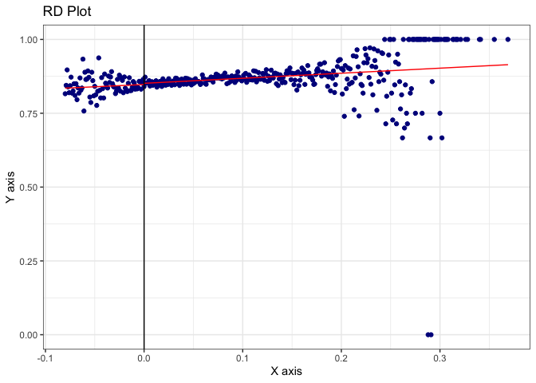

# Hansen DWI Replication

**Directions:** Download `hansen_dwi.dta` from GitHub at the following
address. Note these data are not exactly the same as his because of
confidentiality issues (so he couldn’t share all of it).

<https://github.com/scunning1975/causal-inference-class/raw/master/hansen_dwi.dta>

The outcome variable is `recidivism` which is measuring whether the
person showed back up in the data within 4 months. Use this data to
answer the following questions.

``` r
## hansen.R --------------------------------------------------------------------
## Kyle Butts, CU Boulder Economics
## 
## replicate figures and tables in Hansen 2015 AER

library(data.table)
library(fixest)
library(ggplot2)
library(rdrobust)
library(rddensity)
library(binsreg)

# load the data from github
df <- haven::read_dta("https://github.com/scunning1975/causal-inference-class/raw/master/hansen_dwi.dta")
setDT(df)
```

1.  We will only focus on the 0.08 BAC cutoff; not the 0.15 cutoff. Take
    the following steps.
    -   Create a treatment variable (`dui`) equaling 1 if `bac1 >= 0.08`
        and 0 otherwise in your do/R file.
    -   Replicate Hansen’s Figure 1 examining whether there is any
        evidence for manipulation on the running variable. Produce a raw
        histogram using `bac1`, then use the density test in Cattaneo,
        Titunik and Farrell’s `rddensity` package. Can you find any
        evidence for manipulation? What about heaping?

``` r
# Q1: create some variables
df[, dui := (bac1 > 0.08)]
df[, bac1_old := bac1]

# important to center
df[, bac1 := bac1-0.08]
df[, bac1_sq := bac1^2]

# First, make it as a discrete variable (bac1), once as continuous (bac1).
ggplot(df) + 
  geom_histogram(
    aes(x = bac1), binwidth = 0.001,
    alpha = 0.8, color = "steelblue"
  ) + 
  labs(
    x = "Blood Alcohol Content",
    y = "Frequency",
    title = "Replicating Figure 1 of Hansen AER 2015"
  ) + 
  theme_bw()
```

<!-- -->

``` r
# Second, make it as a continuous variable -- looks like there is heaping that is visible


# Third, use rddensity from Cattnaeo, Titunik and Farrell papers
rdd <- rddensity::rddensity(X = df$bac1)

summary(rdd)
```


    Manipulation testing using local polynomial density estimation.

    Number of obs =       214558
    Model =               unrestricted
    Kernel =              triangular
    BW method =           estimated
    VCE method =          jackknife

    c = 0                 Left of c           Right of c          
    Number of obs         23010               191548              
    Eff. Number of obs    14727               28946               
    Order est. (p)        2                   2                   
    Order bias (q)        3                   3                   
    BW est. (h)           0.023               0.023               

    Method                T                   P > |T|             
    Robust                -0.1387             0.8897              

    Warning in summary.CJMrddensity(rdd): There are repeated observations. Point
    estimates and standard errors have been adjusted. Use option massPoints=FALSE to
    suppress this feature.


    P-values of binomial tests (H0: p=0.5).

    Window Length / 2          <c     >=c    P>|T|
    0.000                     909       0    0.0000
    0.000                     909       0    0.0000
    0.000                     909       0    0.0000
    0.000                     909       0    0.0000
    0.000                     909       0    0.0000
    0.000                     909       0    0.0000
    0.000                     909       0    0.0000
    0.000                     909       0    0.0000
    0.000                     909       0    0.0000
    0.000                     909       0    0.0000

``` r
rddensity::rdplotdensity(rdd, X = df$bac1)
```

<!-- -->

    $Estl
    Call: lpdensity

    Sample size                                      23010
    Polynomial order for point estimation    (p=)    2
    Order of derivative estimated            (v=)    1
    Polynomial order for confidence interval (q=)    3
    Kernel function                                  triangular
    Scaling factor                                   0.107239568040194
    Bandwidth method                                 user provided

    Use summary(...) to show estimates.

    $Estr
    Call: lpdensity

    Sample size                                      191548
    Polynomial order for point estimation    (p=)    2
    Order of derivative estimated            (v=)    1
    Polynomial order for confidence interval (q=)    3
    Kernel function                                  triangular
    Scaling factor                                   0.892755771193669
    Bandwidth method                                 user provided

    Use summary(...) to show estimates.

    $Estplot

<!-- -->

2.  Recreate Table 2 Panel A but only `white`, `male`, age (`aged`) and
    accident (`acc`) as dependent variables. Use your equation 1) for
    this. Are the covariates balanced at the cutoff? Use two separate
    bandwidths (0.03 to 0.13; 0.055 to 0.105) for estimation.

``` r
# Q2: Running regressions on covariates (white, male, age and accident) to see 
# if there is a jump in average values for each of these at the cutoff.
# yi = Xi' \gamma + \alpha_1 DUI_i + \alpha_2 BAC_i + \alpha_3 BAC_i x DUI_i + u_i

# not going to cluster on the running variable because of Kolesar and Rothe 
# (2018) AER that says clustering on the running variable has an extreme
# over-rejection problem. Technically they recommend honest confidence intervals
# but that's in R and I'm not going to do it.

# fixest::feols can do four variables at once and create a table with etable
feols(
  c(white, male, acc, aged) ~ dui + bac1 + i(dui, bac1), 
  df[bac1 >= 0.03 & bac1 <= 0.13, ], vcov = "hc1"
) |> 
  etable()
```

    Variables 'duiTRUE' and 'i(factor_var = dui, var = bac1, ref_special = TRUE)' have been removed because of collinearity (see $collin.var).
    Variables 'duiTRUE' and 'i(factor_var = dui, var = bac1, ref_special = TRUE)' have been removed because of collinearity (see $collin.var).
    Variables 'duiTRUE' and 'i(factor_var = dui, var = bac1, ref_special = TRUE)' have been removed because of collinearity (see $collin.var).
    Variables 'duiTRUE' and 'i(factor_var = dui, var = bac1, ref_special = TRUE)' have been removed because of collinearity (see $collin.var).

                               model 1            model 2            model 3
    Dependent Var.:              white               male                acc
                                                                            
    (Intercept)     0.8487*** (0.0028) 0.7956*** (0.0033) 0.0604*** (0.0028)
    bac1            0.2215*** (0.0350)   -0.0650 (0.0418)  1.233*** (0.0375)
    _______________ __________________ __________________ __________________
    S.E. type       Heteroskedas.-rob. Heteroskedas.-rob. Heteroskedas.-rob.
    Observations               130,356            130,356            130,356
    R2                         0.00031            1.86e-5            0.00860
    Adj. R2                    0.00030            1.09e-5            0.00859

                              model 4
    Dependent Var.:              aged
                                     
    (Intercept)     32.98*** (0.0919)
    bac1             23.28*** (1.165)
    _______________ _________________
    S.E. type       Heteroskeda.-rob.
    Observations              130,356
    R2                        0.00303
    Adj. R2                   0.00302
    ---
    Signif. codes: 0 '***' 0.001 '**' 0.01 '*' 0.05 '.' 0.1 ' ' 1

3.  Recreate Figure 2 panel A-D. Fit a picture using linear and
    separately quadratic with confidence intervals.

``` r
rdplot(df$white, df$bac1, p = 1)
```

    [1] "Mass points detected in the running variable."

<!-- -->

``` r
rdplot(df$white, df$bac1, p = 2)
```

    [1] "Mass points detected in the running variable."

<!-- -->

4.  Estimate equation (1) with recidivism (`recid`) as the outcome. This
    corresponds to Table 3 column 1, but since I am missing some of his
    variables, your sample size will be the entire dataset of 214,558.
    Nevertheless, replicate Table 3, column 1, Panels A and B. Note that
    these are local linear regressions and Panel A uses as its bandwidth
    0.03 to 0.13. But Panel B has a narrower bandwidth of 0.055 to
    0.105. Your table should have three columns and two A and B panels
    associated with the different bandwidths.:
    -   Column 1: control for the `bac1` linearly
    -   Column 2: interact `bac1` with cutoff linearly
    -   Column 3: interact `bac1` with cutoff linearly and as a
        quadratic
    -   For all analysis, estimate uncertainty using heteroskedastic
        robust standard errors. \[ed: But if you want to show off, use
        Kolesár and Rothe’s 2018 “honest” confidence intervals (only
        available in R).\]

``` r
# Q4a: Our main results. regression of recidivism onto the equation (1) model with linear bac1.
feols(
    recidivism ~ i(dui) + bac1, 
    data = df[bac1_old >= 0.03 & bac1_old <= 0.13],
    vcov = "hc1"
)
```

    OLS estimation, Dep. Var.: recidivism
    Observations: 89,967 
    Standard-errors: Heteroskedasticity-robust 
                 Estimate Std. Error  t value   Pr(>|t|)    
    (Intercept)  0.121840   0.002584 47.14846  < 2.2e-16 ***
    dui::TRUE   -0.026585   0.004040 -6.58017 4.7247e-11 ***
    bac1         0.331166   0.074887  4.42223 9.7800e-06 ***
    ---
    Signif. codes:  0 '***' 0.001 '**' 0.01 '*' 0.05 '.' 0.1 ' ' 1
    RMSE: 0.308959   Adj. R2: 4.741e-4

``` r
# Q4b: Our main results. regression of recidivism onto the equation (1) model with interacted linear bac1.
feols(
    recidivism ~ i(dui, bac1), 
    data = df[bac1_old >= 0.03 & bac1_old <= 0.13],
    vcov = "hc1"
)
```

    OLS estimation, Dep. Var.: recidivism
    Observations: 89,967 
    Standard-errors: Heteroskedasticity-robust 
                     Estimate Std. Error  t value   Pr(>|t|)    
    (Intercept)      0.101544   0.002032 49.96249  < 2.2e-16 ***
    dui::FALSE:bac1 -0.615294   0.145436 -4.23067 2.3323e-05 ***
    dui::TRUE:bac1   0.162697   0.070943  2.29334 2.1831e-02 *  
    ---
    Signif. codes:  0 '***' 0.001 '**' 0.01 '*' 0.05 '.' 0.1 ' ' 1
    RMSE: 0.309004   Adj. R2: 1.838e-4

``` r
# Q4c: Our main results. regression of recidivism onto the equation (1) model with interacted linear and quadratic bac1. 
feols(
    recidivism ~ i(dui, bac1) + i(dui, bac1_sq), 
    data = df[bac1_old >= 0.03 & bac1_old <= 0.13],
    vcov = "hc1"
)
```

    OLS estimation, Dep. Var.: recidivism
    Observations: 89,967 
    Standard-errors: Heteroskedasticity-robust 
                         Estimate Std. Error  t value   Pr(>|t|)    
    (Intercept)          0.103014   0.003044 33.83957  < 2.2e-16 ***
    dui::FALSE:bac1     -1.845178   0.464642 -3.97118 7.1574e-05 ***
    dui::TRUE:bac1      -0.439825   0.280981 -1.56532 1.1751e-01    
    dui::FALSE:bac1_sq -40.862239  11.706614 -3.49053 4.8230e-04 ***
    dui::TRUE:bac1_sq   14.626790   5.505662  2.65668 7.8928e-03 ** 
    ---
    Signif. codes:  0 '***' 0.001 '**' 0.01 '*' 0.05 '.' 0.1 ' ' 1
    RMSE: 0.308954   Adj. R2: 4.855e-4

5.  Repeat but drop units in the close vicinity of 0.08 (0.079-0.081)
    (i.e., the “donut hole” regression).

``` r
df_donut <- df[bac1_old < 0.079 | bac1_old > 0.081,]
feols(
    recidivism ~ i(dui, bac1), 
    data = df_donut[bac1_old >= 0.03 & bac1_old <= 0.13],
    vcov = "hc1"
)
```

    OLS estimation, Dep. Var.: recidivism
    Observations: 88,085 
    Standard-errors: Heteroskedasticity-robust 
                     Estimate Std. Error  t value   Pr(>|t|)    
    (Intercept)      0.100642   0.002113 47.63509  < 2.2e-16 ***
    dui::FALSE:bac1 -0.649912   0.147053 -4.41956 9.9018e-06 ***
    dui::TRUE:bac1   0.188881   0.072952  2.58912 9.6238e-03 ** 
    ---
    Signif. codes:  0 '***' 0.001 '**' 0.01 '*' 0.05 '.' 0.1 ' ' 1
    RMSE: 0.30886   Adj. R2: 2.074e-4

``` r
rdrobust(
    y = df_donut$recidivism, x = df_donut$bac1, p = 1
)
```

    [1] "Mass points detected in the running variable."

    Call: rdrobust

    Number of Obs.               212676
    BW type                       mserd
    Kernel                   Triangular
    VCE method                       NN

    Number of Obs.                21128       191548
    Eff. Number of Obs.           13384        31939
    Order est. (p)                    1            1
    Order bias  (q)                   2            2
    BW est. (h)                   0.025        0.025
    BW bias (b)                   0.041        0.041
    rho (h/b)                     0.623        0.623
    Unique Obs.                      79          318

6.  Recreate the top panel of Figure 3 according to the following rule:
    -   Fit linear fit using only observations with less than 0.15 BAC
        on the `bac1`
    -   Fit quadratic fit using only observations with less than 0.15
        BAC on the `bac1`
    -   Use `rdplot` to do the same.
7.  Estimate local polynomial regressions with triangular kernel and
    bias correction using `rdrobust`. Experiment with other kernels and
    polynomials.

``` r
# Local polynomial regressions with triangular kernel and bias correction

rdrobust(
  y = df$recidivism, x = df$bac1, kernel = "tri",
  p = 2, masspoints = "off"
) |> 
  summary()
```

    Sharp RD estimates using local polynomial regression.

    Number of Obs.               214558
    BW type                       mserd
    Kernel                   Triangular
    VCE method                       NN

    Number of Obs.                23010       191548
    Eff. Number of Obs.           16574        41013
    Order est. (p)                    2            2
    Order bias  (q)                   3            3
    BW est. (h)                   0.032        0.032
    BW bias (b)                   0.045        0.045
    rho (h/b)                     0.715        0.715

    =============================================================================
            Method     Coef. Std. Err.         z     P>|z|      [ 95% C.I. ]       
    =============================================================================
      Conventional    -0.017     0.008    -2.134     0.033    [-0.033 , -0.001]    
            Robust         -         -    -1.931     0.053    [-0.035 , 0.000]     
    =============================================================================

``` r
df_donut <- df[donut == FALSE,]
```

    Error: Object 'donut' not found amongst [Date, Alcohol1, Alcohol2, low_score, male, white, recidivism, acc, aged, year, ...]

``` r
est <- rdrobust(
  y = df_donut$recidivism, x = df_donut$bac1, kernel = "tri", 
  p = 2, masspoints = "off"
) |> 
  summary()
```

    Sharp RD estimates using local polynomial regression.

    Number of Obs.               212676
    BW type                       mserd
    Kernel                   Triangular
    VCE method                       NN

    Number of Obs.                21128       191548
    Eff. Number of Obs.           12560        27467
    Order est. (p)                    2            2
    Order bias  (q)                   3            3
    BW est. (h)                   0.023        0.023
    BW bias (b)                   0.039        0.039
    rho (h/b)                     0.589        0.589

    =============================================================================
            Method     Coef. Std. Err.         z     P>|z|      [ 95% C.I. ]       
    =============================================================================
      Conventional    -0.021     0.013    -1.613     0.107    [-0.046 , 0.005]     
            Robust         -         -    -1.442     0.149    [-0.050 , 0.008]     
    =============================================================================

``` r
# Donut nonparameteric presentation
df_summ <- df_donut[
  bac1 >= 0.03 & bac1 <= 0.13, 
  .(recidivism = mean(recidivism)), 
  by = bac1
]
df_summ[, dui := bac1 >= 0.08]

ggplot(df_summ) + 
  geom_vline(xintercept = 0.08, linetype = "dashed", color = "red") +
  geom_point(
    aes(x = bac1, y = recidivism, color = dui)
  ) + 
  geom_smooth(
    aes(x = bac1, y = recidivism, by = dui, color = dui), 
    se = TRUE, method = "loess"
  ) + 
  labs(
    x = "Blood Alcohol Level", y = "Conditional Mean Recidivism Rate",
    color = "Received DUI"
  ) + 
  scale_color_manual(
    values = c("steelblue", "red"), 
    guide = "none"
  ) + 
  theme_bw()
```

    Warning: Ignoring unknown aesthetics: by

    `geom_smooth()` using formula 'y ~ x'

<!-- -->

``` r
# rdplot
df_trimmed <- df[bac1>=0.03 & bac1<=0.13, ]
rdrobust::rdplot(
  y = df_trimmed$recidivism, x = df_trimmed$bac1, c = 0.08, kernel = "tri", p = 4,
  masspoints = "off"
)
```

<!-- -->
