```{r setup, include = F}
# devtools::install_github("Hemken/Statamarkdown")
library(Statamarkdown)
```

# Hansen DWI Replication

**Directions:** Download `hansen_dwi.dta` from GitHub at the following address. Note these data are not exactly the same as his because of confidentiality issues (so he couldn’t share all of it).

https://github.com/scunning1975/causal-inference-class/raw/master/hansen_dwi.dta

The outcome variable is `recidivism` which is measuring whether the person showed back up in the data within 4 months. Use this data to answer the following questions.

```{stata, collectcode = T}
******************************************************************************************
* name: hansen.do
* author: scott cunningham (baylor)
* description: replicate figures and tables in Hansen 2015 AER
* last updated: december 5, 2021
******************************************************************************************
* load the data from github
use https://github.com/scunning1975/causal-inference-class/raw/master/hansen_dwi, clear

* Re-center our running variable at bac1=0.08
ren bac1 bac1_old
gen bac1=bac1_old-0.08
```


1. We will only focus on the 0.08 BAC cutoff; not the 0.15 cutoff. Take the following steps.
    - Create a treatment variable (`dui`) equaling 1 if `bac1 >= 0.08` and 0 otherwise in your do/R file.
    - Replicate Hansen’s Figure 1 examining whether there is any evidence for manipulation on the running variable. Produce a raw histogram using `bac1`, then use the density test in Cattaneo, Titunik and Farrell’s `rddensity` package. Can you find any evidence for manipulation? What about heaping?


```{stata, collectcode = T}
* Q1a: create some treatment variable for bac1>=0.08
gen dui = 0
replace dui = 1 if bac1_old>=0.08 & bac1~=. // Stata when it sees a period (missing) in a variable it 
// thinks that that observation is equal to positive infinity. And so since positive infinity
// is greater than 0.08, it will assign dui = 1 for that missing value which can create
// major problems. 
```

```{stata, echo = 1:2}
* Q1b: Find evidence for manipulation or HEAPING using histograms
histogram bac1, discrete width(0.001) ytitle(Density) xtitle(Running variable (blood alcohol content)) xline(0.0) title(Density of observations across the running variable)
quietly graph export graph1.svg, replace
```


```{stata, echo = 1:2}
* use the Cattaneo, et al. -rddensity-
rddensity bac1, c(0.0) plot
quietly graph export graph2.svg, replace
```

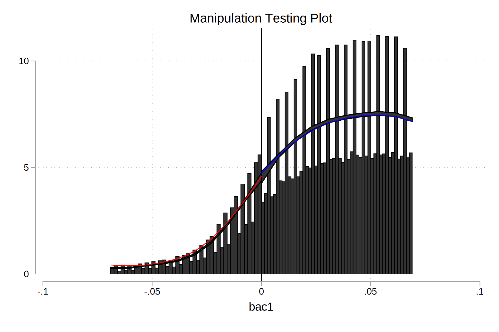


2. Recreate Table 2 Panel A but only `white`, `male`, age (`aged`) and accident (`acc`) as dependent variables. Use your equation 1) for this. Are the covariates balanced at the cutoff? Use two separate bandwidths (0.03 to 0.13; 0.055 to 0.105) for estimation.

```{stata}
* Q2: Table 2 on white, male, aged, and acc
* yi = Xi′γ + α1DUIi + α2BACi + α3BACi × DUIi + ui
* Are the covariates balanced at the cutoff? Use two separate bandwidths (0.03 to 0.13; 0.055 to 0.105) 

reg white dui##c.bac1 if bac1_old>=0.03 & bac1_old<=0.13, robust
reg male dui##c.bac1 if bac1_old>=0.03 & bac1_old<=0.13, robust
reg acc dui##c.bac1 if bac1_old>=0.03 & bac1_old<=0.13, robust
reg aged dui##c.bac1 if bac1_old>=0.03 & bac1_old<=0.13, robust
```


3. Recreate Figure 2 panel A-D. Fit a picture using linear and separately quadratic with confidence intervals.

```{stata, echo=c(-4,-6,-8)}
* Q3: Create Figure 2 panel A-D using cmogram on our covariates (white, male, age, acc)
* cmogram outcome running variable, cut(cutoff) scatter line(cutoff) polynomial
quietly cmogram white bac1, cut(0.0) scatter line(0.0)
quietly graph export graph3.svg, replace
quietly cmogram white bac1, cut(0.0) scatter line(0.0) lfitci
quietly graph export graph4.svg, replace
quietly cmogram white bac1, cut(0.0) scatter line(0.0) qfitci
quietly graph export graph5.svg, replace
```

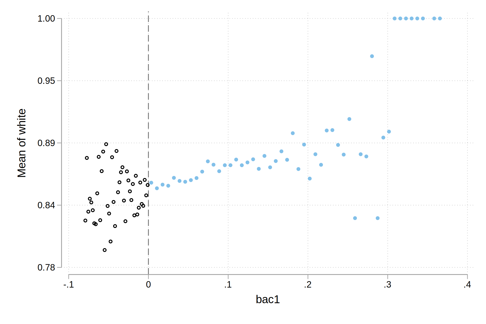

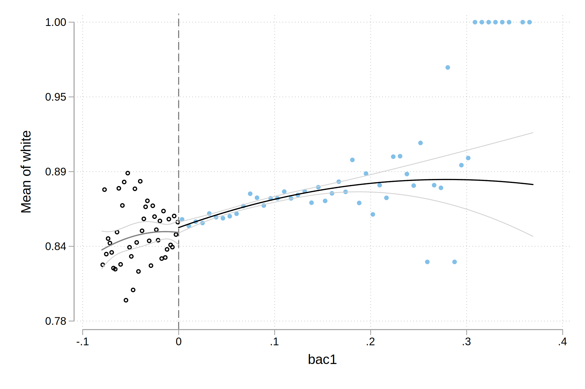


```{stata, echo=c(-3)}
* scatter
twoway (scatter white bac1  if bac1_old>=0.03 & bac1_old<=0.13, sort) if bac1_old>=0.03 & bac1_old<=0.13, ytitle(White means) xtitle(Blood alcohol content running variable) xline(0.08) title(Covariate test on whites) note(Cutoff is at blood alcohol content of 0.08)
quietly graph export graph6.svg, replace
```


```{stata, echo=c(-3,-5,-7)}
* binscatter
binscatter white bac1 if bac1_old>=0.03 & bac1_old<=0.13
quietly graph export graph7.svg, replace
binscatter white bac1 if bac1_old>=0.03 & bac1_old<=0.13, by(dui)
quietly graph export graph8.svg, replace
binscatter white bac1 if bac1_old>=0.03 & bac1_old<=0.13, by(dui) line(qfit)
quietly graph export graph9.svg, replace
```

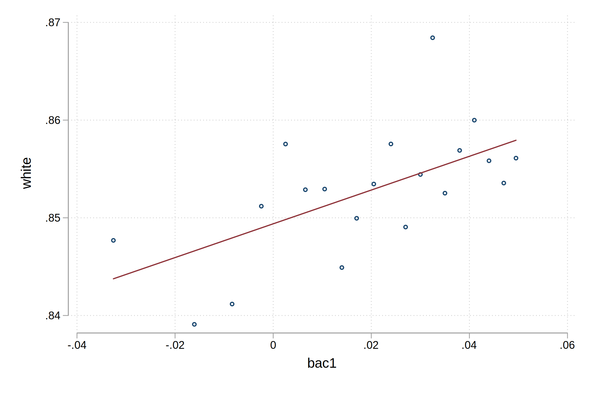
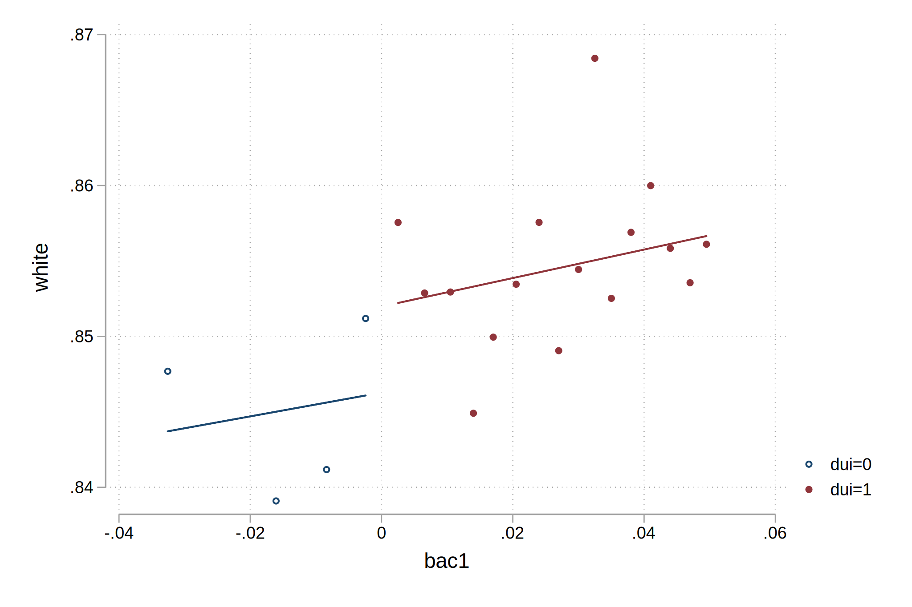
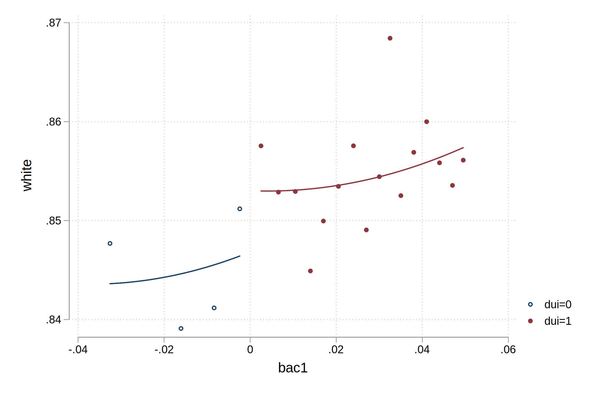

4. Estimate equation (1) with recidivism (`recid`) as the outcome. This corresponds to Table 3 column 1, but since I am missing some of his variables, your sample size will be the entire dataset of 214,558. Nevertheless, replicate Table 3, column 1, Panels A and B. Note that these are local linear regressions and Panel A uses as its bandwidth 0.03 to 0.13. But Panel B has a narrower bandwidth of 0.055 to 0.105. Your table should have three columns and two A and B panels associated with the different bandwidths.:
	- Column 1: control for the `bac1` linearly
- Column 2: interact `bac1` with cutoff linearly
- Column 3: interact `bac1` with cutoff linearly and as a quadratic
- For all analysis, estimate uncertainty using heteroskedastic robust standard errors. [ed: But if you want to show off, use Kolesár and Rothe’s 2018 "honest" confidence intervals (only available in R).]

```{stata}
* Q4a: Our main results. regression of recidivism onto the equation (1) model with linear bac1. 
reg recidivism dui bac1 if bac1_old>=0.03 & bac1_old<=0.13, robust

* Q4b: Our main results. regression of recidivism onto the equation (1) model with interacted linear bac1. 
reg recidivism dui##c.bac1 if bac1_old>=0.03 & bac1_old<=0.13, robust

* Q4c: Our main results. regression of recidivism onto the equation (1) model with interacted linear and quadratic bac1. 
gen bac1_squared = bac1^2
reg recidivism dui##c.(bac1 bac1_squared) if bac1_old>=0.03 & bac1_old<=0.13, robust
```

5. Repeat but drop units in the close vicinity of 0.08 (0.079-0.081) (i.e., the "donut hole" regression).

```{stata, echo=c(-6)}
* Q5: "donut hole" dropping close to 0.08 (we'll discuss why later)
preserve
drop if bac1_old>=0.079 & bac1_old<=0.081
reg recidivism dui##c.(bac1) if bac1_old>=0.03 & bac1_old<=0.13, robust
rdrobust recidivism bac1, c(0.0) p(1) bwselect(msetwo) all
restore
```

6. Recreate the top panel of Figure 3 according to the following rule:
    - Fit linear fit using only observations with less than 0.15 BAC on the `bac1`
    - Fit quadratic fit using only observations with less than 0.15 BAC on the `bac1`
    - Use `rdplot` to do the same.


```{stata, echo=c(-3,-5,-7)}
* Q6: Figure 3 using less than 0.15 bac on the bac1
quietly cmogram recidivism bac1, cut(0.0) scatter line(0.0) lfitci
quietly graph export graph10.svg, replace
quietly cmogram recidivism bac1 if bac1_old>=0.03 & bac1_old<=0.13, cut(0.0) scatter line(0.0) lfitci
quietly graph export graph11.svg, replace
quietly cmogram recidivism bac1 if bac1_old>=0.03 & bac1_old<=0.13, cut(0.0) scatter line(0.0) qfitci
quietly graph export graph12.svg, replace
```

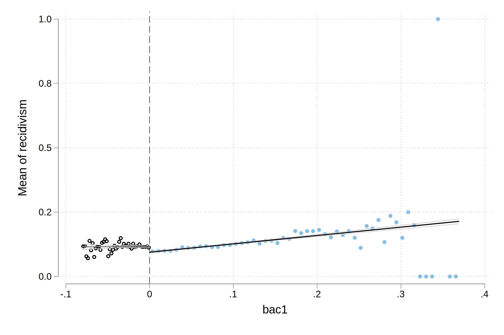
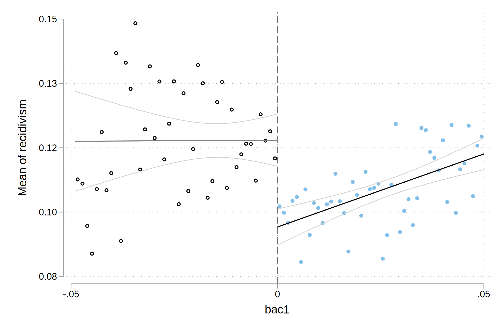
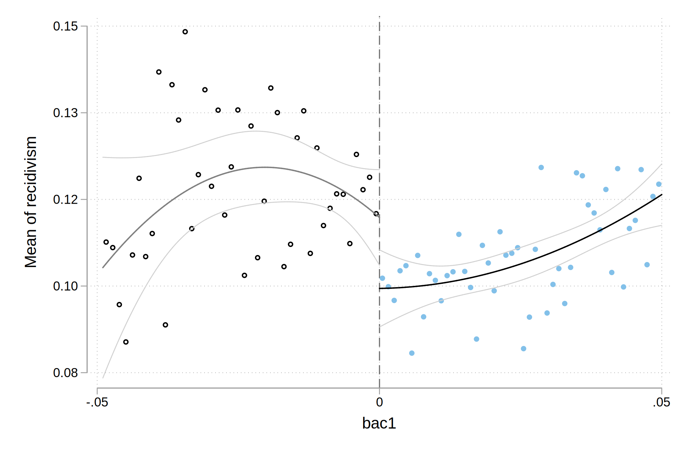

```{stata, echo=c(-2,-4)}
binscatter recidivism bac1 if bac1_old>=0.03 & bac1_old<=0.13, by(dui)
quietly graph export graph13.svg, replace
binscatter recidivism bac1 if bac1_old>=0.03 & bac1_old<=0.13, by(dui) line(qfit)
quietly graph export graph14.svg, replace
```

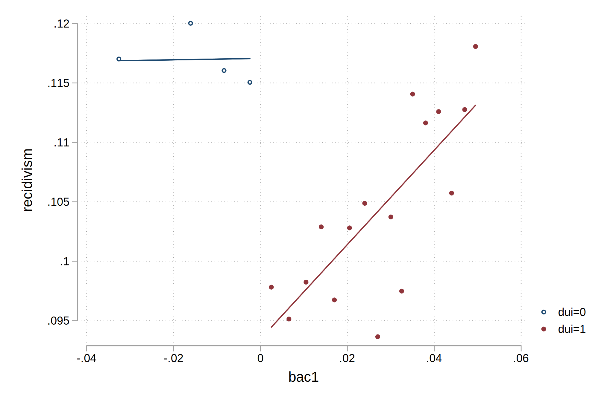
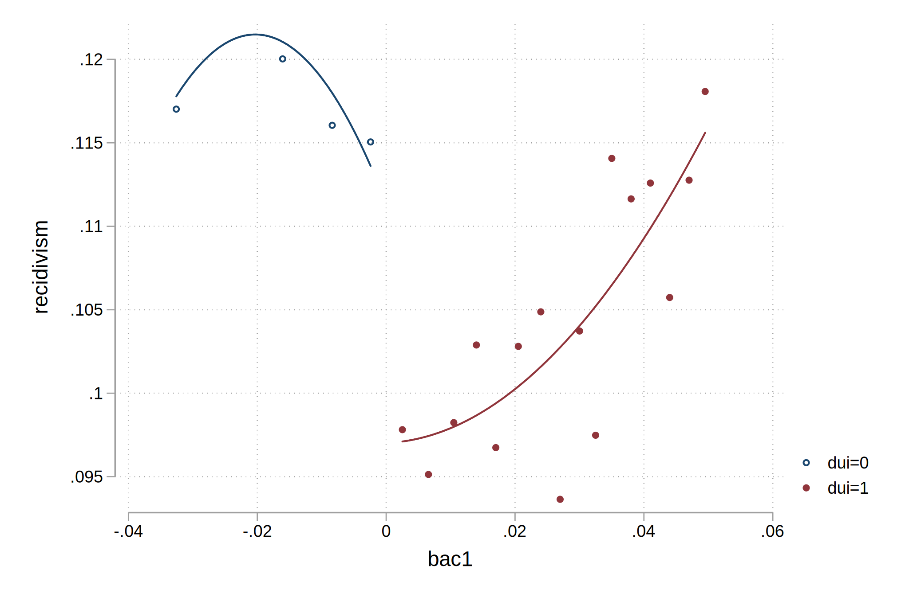

7. Estimate local polynomial regressions with triangular kernel and bias correction using `rdrobust`. Experiment with other kernels and polynomials.

```{stata}
* Q7: Local polynomial regressions with (default) triangular kernel and bias correction
rdrobust recidivism bac1, p(1) c(0.0)
rdrobust recidivism bac1, p(1) c(0.0) kernel(uniform)
rdrobust recidivism bac1, p(1) c(0.0) kernel(epanechnikov)
```


```{stata}
* Higher order polynomials
rdrobust recidivism bac1, p(2) c(0.0)
rdrobust recidivism bac1, p(3) c(0.0)
rdrobust recidivism bac1, p(4) c(0.0)
```


```{stata, echo=c(-3,-5), include = FALSE}
* RD PLOT
rdplot recidivism bac1 if bac1_old>=0.03 & bac1_old<=0.13, p(0) masspoints(off) c(0.0) graph_options(title(Recidivism for BAC of 0.08))
quietly graph export graph15.svg, replace
rdplot recidivism bac1 if bac1_old>=0.03 & bac1_old<=0.13, p(2) masspoints(off) c(0.0) graph_options(title(Recidivism for BAC of 0.08))
quietly graph export graph16.svg, replace
```

<!-- Can't get to work right now -->
<!--  -->
<!--  -->

```{stata, echo=c(-3)}
* McCrary density test: remember it's a density test *on the running variable* (lagdemvoteshare)
rddensity bac1, c(0.0) plot
quietly graph export graph17.svg, replace
```
						
															 
																					 
																					 
																					 
																					 
																					 
