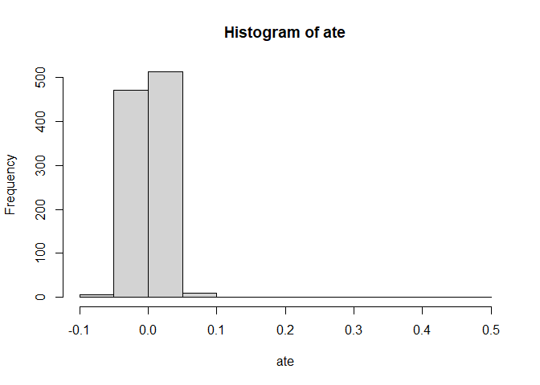

# Thornton HIV Replication

## Part 1: Experimental Analysis

Load data from the following url:
`https://raw.github.com/scunning1975/mixtape/master/thornton_hiv.dta`

``` r
library(tidyverse)
```

    ## Warning: package 'tidyverse' was built under R version 4.1.3

    ## -- Attaching packages --------------------------------------- tidyverse 1.3.2 --
    ## v ggplot2 3.3.6     v purrr   0.3.4
    ## v tibble  3.1.8     v dplyr   1.0.9
    ## v tidyr   1.2.0     v stringr 1.4.0
    ## v readr   2.1.2     v forcats 0.5.1

    ## Warning: package 'ggplot2' was built under R version 4.1.3

    ## Warning: package 'tibble' was built under R version 4.1.3

    ## Warning: package 'tidyr' was built under R version 4.1.3

    ## Warning: package 'readr' was built under R version 4.1.3

    ## Warning: package 'purrr' was built under R version 4.1.3

    ## Warning: package 'dplyr' was built under R version 4.1.3

    ## Warning: package 'stringr' was built under R version 4.1.3

    ## Warning: package 'forcats' was built under R version 4.1.3

    ## -- Conflicts ------------------------------------------ tidyverse_conflicts() --
    ## x dplyr::filter() masks stats::filter()
    ## x dplyr::lag()    masks stats::lag()

``` r
library(fixest)
```

    ## Warning: package 'fixest' was built under R version 4.1.3

``` r
library(haven)
```

    ## Warning: package 'haven' was built under R version 4.1.3

``` r
df <- haven::read_dta("https://raw.github.com/scunning1975/mixtape/master/thornton_hiv.dta")
```

Rebecca Thornton’s paper [The Demand for, and Impact of, Learning HIV
Status](https://www.rebeccathornton.net/wp-content/uploads/2019/08/Thornton-AER2008.pdf)
at *AER* evaluated an experiment in rural Malawi which gave cash
incentives for people to follow-up and learn their HIV test result.
Thornton’s total sample was 2,901 participants. Of those, 2,222 received
any incentive at all.

Variable descriptions are available in the [codebook](codebook.pdf)

The variable `any` is an indicator variable for if the participant
received *any* incentive. The variable `got` denotes that the individual
went and *got* their test result information.

1.  Calculate by hand the simple difference in means of `got` based on
    treatment status `any`. Then use a simple linear regression to see
    if the result is the same.

``` r
# the `with` command lets you access variables in `df` without 
# doing `df$` a bunch
with(df, {
  mean(got[any == 1], na.rm = TRUE) - mean(got[any == 0], na.rm = TRUE)
})
```

    ## [1] 0.4505519

``` r
# Cluster SEs by village
feols(got ~ i(any), data = df, cluster = ~villnum)
```

    ## NOTE: 1,990 observations removed because of NA values (LHS: 1,926, RHS: 1,919, vcov: 27).

    ## OLS estimation, Dep. Var.: got
    ## Observations: 2,830 
    ## Standard-errors: Clustered (villnum) 
    ##             Estimate Std. Error t value  Pr(>|t|)    
    ## (Intercept) 0.338684   0.023685 14.2996 < 2.2e-16 ***
    ## any::1      0.451982   0.022686 19.9234 < 2.2e-16 ***
    ## ---
    ## Signif. codes:  0 '***' 0.001 '**' 0.01 '*' 0.05 '.' 0.1 ' ' 1
    ## RMSE: 0.422355   Adj. R2: 0.16401

2.  Following Table 3, we are going to check if the baseline
    characteristics look the same, on average, between the treated and
    the control group. Test if the following varaibles differ
    significantly between treated and the control groups after
    controlling for `tinc`, `under`, `rumphi`, and `balaka`.

-   gender via `male`
-   baseline age via `age`
-   whether they had HIV in the baseline via `hiv2004`
-   the baseline level of years of education via `educ2004`
-   whether they owned any land in the baseline via `land2004`
-   whether they used condoms in the baseline via `usecondom04`.
    Interpret whether the results give you confidence in the experiment.

``` r
feols(
  c(male, age, hiv2004, educ2004, land2004, usecondom04) ~ 
  i(any) + tinc + i(under) + i(rumphi) + i(balaka), 
  data = df, cluster = ~villnum
) |> 
  etable()
```

    ## NOTE: 1,923 observations removed because of NA values (RHS: 1,919, vcov: 27). [This msg only concerns the variables common to all estimations.]

    ##                            model 1           model 2           model 3
    ## Dependent Var.:               male               age           hiv2004
    ##                                                                       
    ## (Intercept)     0.4783*** (0.0260) 31.14*** (0.7064) 0.0482** (0.0152)
    ## any = 1           -0.0348 (0.0307)  1.898** (0.6906)  -0.0079 (0.0174)
    ## tinc               0.0130 (0.0138) -0.5111. (0.3018)  -0.0004 (0.0071)
    ## under = 1         -0.0020 (0.0144)  -0.5298 (0.6433)  0.0268* (0.0106)
    ## rumphi = 1         0.0052 (0.0195)   1.788* (0.7929)  -0.0122 (0.0123)
    ## balaka = 1        -0.0023 (0.0183)  2.663** (0.9285)  0.0250. (0.0138)
    ## _______________ __________________ _________________ _________________
    ## S.E.: Clustered        by: villnum       by: villnum       by: villnum
    ## Observations                 2,897             2,892             2,830
    ## R2                         0.00071           0.00879           0.00629
    ## Adj. R2                   -0.00102           0.00707           0.00453
    ## 
    ##                            model 4             model 5            model 6
    ## Dependent Var.:           educ2004            land2004        usecondom04
    ##                                                                          
    ## (Intercept)      2.834*** (0.2224)  0.7430*** (0.0283) 0.2212*** (0.0264)
    ## any = 1           -0.1973 (0.1905)     0.0083 (0.0251)   -0.0311 (0.0213)
    ## tinc               0.1021 (0.0903)     0.0073 (0.0103)    0.0029 (0.0096)
    ## under = 1         0.3540. (0.1858)    -0.0074 (0.0178)   -0.0067 (0.0210)
    ## rumphi = 1       2.618*** (0.2369) -0.1591*** (0.0303)  0.0680** (0.0259)
    ## balaka = 1      -0.7128** (0.2398)  0.1009*** (0.0284)   -0.0221 (0.0267)
    ## _______________ __________________ ___________________ __________________
    ## S.E.: Clustered        by: villnum         by: villnum        by: villnum
    ## Observations                 2,603               2,669              2,444
    ## R2                         0.16592             0.06675            0.01185
    ## Adj. R2                    0.16432             0.06500            0.00982
    ## ---
    ## Signif. codes: 0 '***' 0.001 '**' 0.01 '*' 0.05 '.' 0.1 ' ' 1

3.  Interestingly, Thornton varied the amount of incentive individuals
    received (in the variable `tinc`). Let’s try comparing treatment
    effects at different incentive amounts. This is called a
    `dose response` function. Let’s attempt to learn about the dose
    response function in two ways:

<!-- -->

1.  Calculate a treatment effect using only individuals with `tinc`
    above 2 (the upper end of incentives). Calculate a treatment effect
    using indviduals who receive a positive `tinc` but less than 1. Does
    the treatment effect grow with incentive?

``` r
# high incentive
feols(
  got ~ i(any), 
  data = df |> filter(tinc >= 2 | tinc == 0), cluster = ~villnum
)
```

    ## NOTE: 59 observations removed because of NA values (LHS: 58, vcov: 1).

    ## OLS estimation, Dep. Var.: got
    ## Observations: 994 
    ## Standard-errors: Clustered (villnum) 
    ##             Estimate Std. Error t value  Pr(>|t|)    
    ## (Intercept) 0.338684   0.023696 14.2928 < 2.2e-16 ***
    ## any::1      0.515764   0.029168 17.6824 < 2.2e-16 ***
    ## ---
    ## Signif. codes:  0 '***' 0.001 '**' 0.01 '*' 0.05 '.' 0.1 ' ' 1
    ## RMSE: 0.432202   Adj. R2: 0.249131

``` r
# low incentive
feols(
  got ~ i(any), 
  data = df |> filter(tinc <= 1 | tinc == 0), cluster = ~villnum
)
```

    ## NOTE: 65 observations removed because of NA values (LHS: 62, vcov: 3).

    ## OLS estimation, Dep. Var.: got
    ## Observations: 1,760 
    ## Standard-errors: Clustered (villnum) 
    ##             Estimate Std. Error t value  Pr(>|t|)    
    ## (Intercept) 0.338684   0.023687 14.2980 < 2.2e-16 ***
    ## any::1      0.386910   0.023701 16.3248 < 2.2e-16 ***
    ## ---
    ## Signif. codes:  0 '***' 0.001 '**' 0.01 '*' 0.05 '.' 0.1 ' ' 1
    ## RMSE: 0.455972   Adj. R2: 0.140886

2.  Calculate a linear dose response function by regression `got` on
    `any` and `tinc`. Note `any` represents the treatment effect at 0
    cash incentive (the intercept) and `tinc` represents the marginal
    change in treatment effect from increasing `tinc`.

``` r
# linear dose-response curve
feols(
  got ~ i(any) + tinc, 
  data = df, cluster = ~villnum
)
```

    ## NOTE: 1,990 observations removed because of NA values (LHS: 1,926, RHS: 1,919, vcov: 27).

    ## OLS estimation, Dep. Var.: got
    ## Observations: 2,830 
    ## Standard-errors: Clustered (villnum) 
    ##             Estimate Std. Error  t value  Pr(>|t|)    
    ## (Intercept) 0.338684   0.023689 14.29704 < 2.2e-16 ***
    ## any::1      0.345204   0.026120 13.21616 < 2.2e-16 ***
    ## tinc        0.082769   0.012236  6.76443 5.448e-10 ***
    ## ---
    ## Signif. codes:  0 '***' 0.001 '**' 0.01 '*' 0.05 '.' 0.1 ' ' 1
    ## RMSE: 0.418097   Adj. R2: 0.180492

## Part 2: Randomization Inference

1.  Estimate the treatment effect of any cash incentive on receiving
    test results. Perform randomization-based inference to calculate an
    approximate p-value for the estimate.

``` r
df <- df |> filter(!is.na(any))

permuteHIV <- function(df, random = TRUE) {
  # Shuffle `any`
  if(random == TRUE) {
    df$any <- sample(df$any, replace = FALSE)
  }
  
  # `with` lets you access variables in tb without doing tb$ a bunch
  ate <- with(df, {
    mean(got[any == 1], na.rm = TRUE) - mean(got[any == 0], na.rm = TRUE)
  })
  
  return(ate)
}

# Observed treatment effect
permuteHIV(df, random = FALSE)
```

    ## [1] 0.4505519

``` r
n_iterations <- 1000

# Run iterations
ate <- c(permuteHIV(df, random = FALSE))
for(i in 1:(n_iterations - 1)) {
  ate <- c(ate, permuteHIV(df, random = TRUE))
}

# Histogram of placebo effects
hist(ate)
```

<!-- -->

``` r
#calculating the p-value
ate = abs(ate)
obs_te = ate[1]

# `ecdf` gives us the empirical CDF of `ate`
empirical_cdf = ecdf(ate)

# percentile of obs_te
obs_percentile = empirical_cdf(obs_te)

# p-value 
1 - obs_percentile
```

    ## [1] 0
